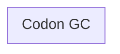
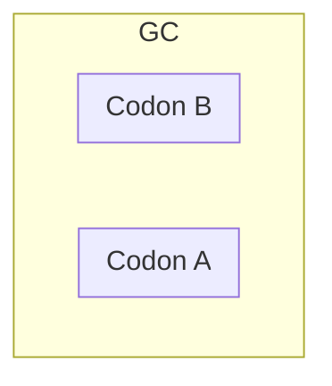
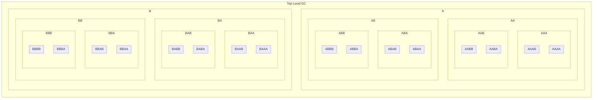

# Genetric Code Logical Structure
A genetic codes, GC, is a recursively embedded structure. A GC may have none, one or two embedded GCs that are connected as a graph. The GC graph is deswcribed in ... A GC with no embedded GCs is called a codon. Codons represent a functional primitive.

Embedded GCs are identified as A or B. The diagram below shows a GC with a GC A and a GC B both of which are codons.

GCs can be infinitely embedded. The diagram below shows four levels of embedding.
