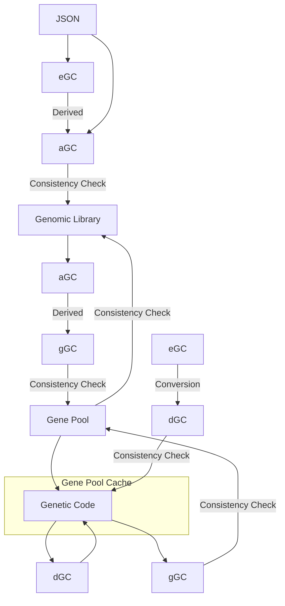

# GC Type Flows

# Transformations

Column header types can be converted row types where there is an **X**

|     | eGC | dGC | gGC | GC | aGC |
|-----|-----|-----|-----|----|-----|
| eGC |  X  |     |     |    |     |
| dGC |  X  |  X  |     |  X |     |
| gGC |     |     |  X  |  X |  X  |
| GC  |     |  X  |  X  |  X |     |
| aGC |  X  |     |     |    |  X  |