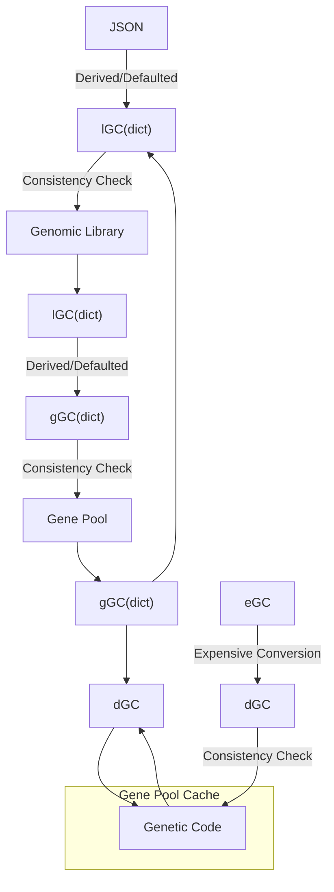
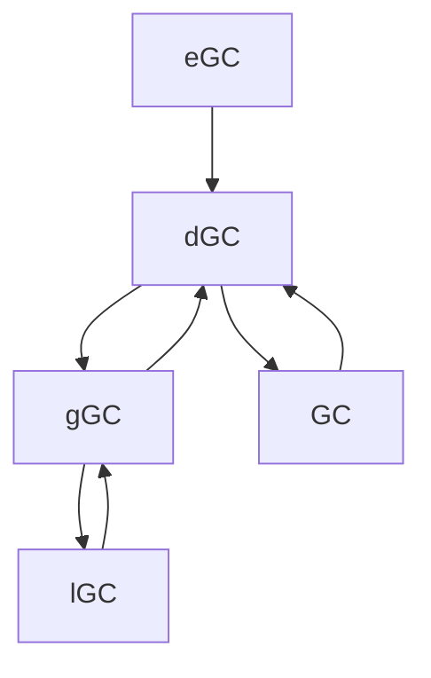

# GC Type Flows

# eGC, dGC, gGC, GC, lGC...WTFGC

Erasmus has multiple layers each responsible for a different aspect of the system with its own functional and related storage and performance requirements. This leads to several related but different storage types for a genetic code.

- *GC = <u>**G**</u>enetic <u>**C**</u>ode
- e = <u>**E**</u>mbryonic
- d = <u>**D**</u>ynamic
- g = <u>**G**</u>ene Pool
- l = Genomic <u>**L**</u>ibrary

## Embryonic Genetic Code

The eGC class is a custom class requiring the minimum number of parameters to make an internal working GC object from basic python types independent of any persistent store. Since GC's should never just wink into existance like magic this type is only used in test functions. The conversion to a dGC is expensive because duplicate graph and related sub-objects are explicitly avoided requiring lots of look ups.

## Dynamic Genetic Code

The dGC is very similar to a genetic_code. It uses the same types for parameters and has the same parameter requirements. However, it is not bound to the Gene Pool Cache storage. Its use is in manipulating genetic codes (mutations, cross-over and the like) in low volume using standard python storage mechanisms i.e. the code can focus on the logic and not worry about the storage manipulation.

## GC

GC (genetic_code) custom class is a hyperspecialized internal object tightly coupled to the Gene Pool Cache object. The intent is to balance efficient storage with fast traveral and recall. It makes a lot of use of shared object pointers and indexed numpy arrays. It should **NOT** be used for manipulation...that is for dGC's.

## Gene Pool Genetic Code

gGCs are dictionary based objects used to prepare and recieve data from the persistent database store of the Gene Pool. The methods extending the dictionary class are for data integrity and conversion to other GC types (see Transformations section).

## Genomic Library Genetic Code

lGC's are the same concept as gGC's but for the Genomic Library. The Genomic Library has different storage and search requirements to the Gene Pool requiring a different representation.

## Transformations

Column header types can be converted row types where there is an **X**

|     | eGC | dGC | gGC | GC | lGC |
|-----|-----|-----|-----|----|-----|
| eGC |     |     |     |    |     |
| dGC |  X  |     |  X  |  X |     |
| gGC |     |     |     |    |  X  |
| GC  |     |  X  |     |    |     |
| lGC |     |     |  X  |    |     |

